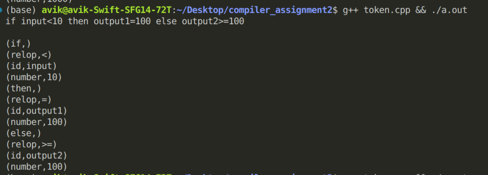
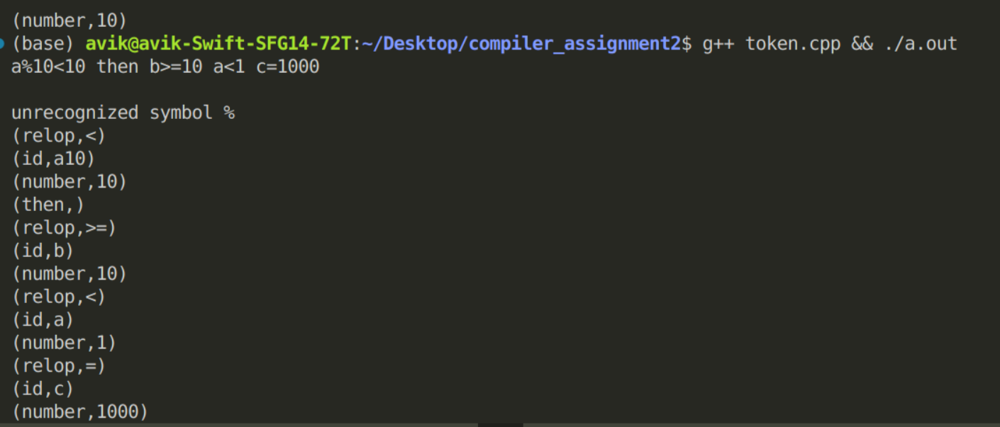
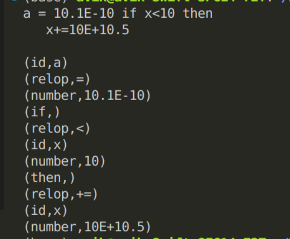

# Lexical Analyzer in C++
**This program is a simple Lexical Analyzer built using C++ that reads input lines from standard input (cin) and tokenizes them into keywords, identifiers, numbers, and relational operators. It also performs basic error checking for invalid characters and variable naming.**
## Features
   - *Identifies and categorizes:*
       1. Keywords: if, else, then
       2. Identifiers: Variable names (starting with a letter, can contain digits)
       3. Numbers: Integer numbers
       4. Relational Operators: <, >, =
       5. It also reads decimal numbers 
       6. Supports exponent like 10E+10 etc
       7. Also recognizes += and -= operators (I considered them in same class as relop)
   - *Detects and prints errors for:*
       1. Unrecognized symbols
       2. Invalid variable names (e.g., starting with a digit followed by a letter)
       

## Token Format
   - Keywords: (keyword,)
   - Identifiers: (id,identifier)
   - Numbers: (number,value)
   - Relational Operators: (relop,operator)
   
## How to use 
   - Clone the repo / copy the code
   - use command g++ token.cpp
   - ./a.out
   - give input string 
   - press Enter after you have completed giving the string
   - to exit press Enter two times
## Examples
- Example1

   

- Example2
  

- Example3

  
   
